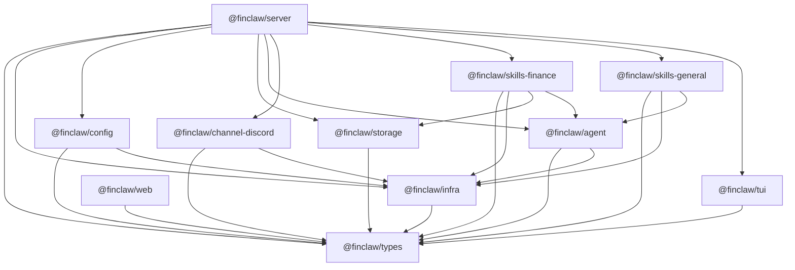
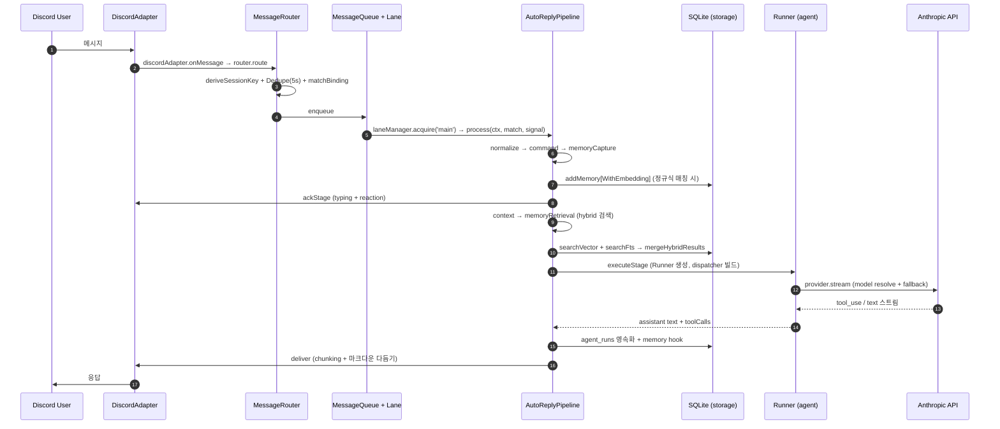

# FinClaw

> 본인 1인이 읽고 감사할 수 있는 금융 특화 AI 비서.

FinClaw 는 사용자 본인의 투자 판단·시장 조사·포트폴리오 관리를 보조하기 위한 개인용 AI 비서다. Anthropic Claude 를 코어로, Discord·Web UI·TUI 세 채널에서 동시에 호출할 수 있고, 시세·뉴스·알림·거래 이력·기억(RAG)·cron 자동화를 SQLite 단일 파일에 영속화한다. 프로덕트 출시·다인 사용·자동 매매를 목표로 하지 않으며, "전체 코드를 한 사람이 읽고 수정할 수 있는 크기" 와 "감사 가능성·환각 방지" 가 설계 우선순위다.

## 왜 FinClaw 인가

- **금융 도메인에 한정한 축약 코드베이스** — 11 워크스페이스 패키지, OpenClaw 아키텍처의 금융 특화 축소판. 한 사람이 전부 읽고 수정 가능한 크기를 의도.
- **감사 가능성 우선** — 모든 거래 입력·기억·`agent.run` 결과·RAG 주입 ID 가 SQLite (`transactions`, `memories`, `agent_runs`) 에 영속화되며, 회상 시 어떤 기억이 주입됐는지 로그로 남는다.
- **명시적 선언 기반 기억** — 사용자가 `!finclaw remember`, `기억해`, `메모`, `선호`, `내 (투자) 원칙은 …` 같은 정규식 패턴을 사용할 때만 저장. LLM 자동 추출은 환각 위험으로 의도적 비대상.
- **읽기 전용 + 수동 입력 거래 이력** — `finance.transaction.add` 는 사용자가 "이미 한 매매" 를 기록하는 경로지 "FinClaw 가 자동 매매" 가 아니다. holdings 는 transactions 로부터 파생.
- **외부 키 없이 작동하는 mock-only 테스트 스탠스** — 4-tier vitest (unit / storage / e2e / live) 분리. 라이브 API 호출은 `test:live` 로만 격리.

비대상: 다중 사용자·RBAC·SSO 가 필요한 팀·조직, 자동 매매 목적 사용자, OpenClaw 같은 범용 멀티채널 AI 플랫폼을 찾는 사용자.

## 빠른 시작 (5 분)

### 요구사항

| 항목    | 버전                                               |
| ------- | -------------------------------------------------- |
| Node.js | `>= 22.0.0` (`node:sqlite` 내장 모듈 사용)         |
| pnpm    | `10.4.1` (root `package.json` 의 `packageManager`) |
| Docker  | (선택, `pnpm dev:all` 사용 시)                     |

```bash
corepack enable
corepack prepare pnpm@10.4.1 --activate
```

### 설치

```bash
pnpm setup            # .env 복사 + pnpm install + ~/.finclaw/ 생성
# 그 다음 .env 를 편집해 ANTHROPIC_API_KEY, DISCORD_BOT_TOKEN, DISCORD_APPLICATION_ID 입력
pnpm build
```

### 실행

```bash
# 로컬 단독 server (Discord + Gateway)
pnpm dev

# Docker 로 server + web 동시 기동
pnpm dev:all
```

부팅이 완료되면 로그에 `Gateway listening on …` 이 찍힌다. Discord 봇이 온라인 상태가 되면 멘션이나 `!finclaw <메시지>` 로 대화할 수 있다.

> ⚠️ **함정**: 로컬 `pnpm dev` 는 `.env` 자동 로드를 하지 않는다. 셸에서 `export` 하거나 `node --env-file=.env` 를 쓰거나, Docker 경로(`pnpm dev:all`) 를 사용해야 한다. Docker compose 는 `env_file: .env` 로 자동 주입한다.

## 기능

### 1. 대화 (auto-reply 파이프라인)

Discord 멘션 또는 `!finclaw <메시지>` 로 자연어 대화. 메시지 한 건이 들어오면 다음 8 단계 파이프라인을 거친다 (`packages/server/src/auto-reply/pipeline.ts`):

```
Normalize → Command → MemoryCapture → ACK → Context → MemoryRetrieval → Execute → Deliver
```

- **Command**: `!finclaw help|reset|status|price|portfolio|alert` 등 인-채팅 명령어. (`/price`·`/portfolio`·`/alert` 는 placeholder — 실 기능은 LLM 자연어 호출.)
- **MemoryCapture**: 정규식 5종(`!finclaw remember …`, `기억해: …`, `메모: …`, `선호: …`, `내 (투자) 원칙은 …`) 매칭 시 `memories` 테이블에 저장. SHA-256 dedup, 임베딩 실패 시 FTS-only fallback.
- **MemoryRetrieval**: 매 발화마다 hybrid (vector + FTS5) RAG 검색. 임계값 0.65, 신선도 반감기 90 일, 상한 3 개. 발화에서 추출된 티커별 거래 이력 3 건도 함께 시스템 프롬프트의 "사용자 배경지식" 섹션에 주입.

### 2. 금융 스킬 (LLM 도구)

대화 도중 LLM 이 호출하는 function-calling 도구. 키 미설정 시 해당 도구는 **등록 자체를 건너뛴다** (graceful degradation).

| 카테고리   | 도구                                                            | 외부 의존                               |
| ---------- | --------------------------------------------------------------- | --------------------------------------- |
| 시세       | `get_stock_price`, `get_market_chart`                           | `ALPHA_VANTAGE_KEY`                     |
| 시세       | `get_crypto_price`                                              | (선택) `COINGECKO_API_KEY`              |
| 시세       | `get_forex_rate`                                                | Frankfurter (키 불필요)                 |
| 뉴스       | `get_financial_news`                                            | `ALPHA_VANTAGE_KEY` (RSS 자동 fallback) |
| 분석       | `analyze_market`                                                | `ANTHROPIC_API_KEY` (Opus floor 강제)   |
| 포트폴리오 | `get_portfolio_summary`                                         | (없음)                                  |
| 알림       | `set_alert`, `list_alerts`, `remove_alert`, `get_alert_history` | (없음, 내부 SQLite)                     |

추가로 일반 스킬 3 종이 항상 등록된다: `get_current_datetime`, `web_fetch` (사설 IP 차단 SSRF 가드), `read_local_file` (`FINCLAW_FILE_ROOT` 루트 강제).

### 3. 자동화 (cron 스케줄러, Phase 28)

Web Settings 또는 `schedule.create` RPC 로 cron 표현식과 prompt 를 등록하면, `SchedulerService` 가 매 분 폴러로 매칭되는 schedule 을 찾아 `agent.run` 을 직접 실행하고 결과를 Discord DM 또는 Web 알림으로 송출한다.

- Cron 파서: 5필드 (분 시 일 월 요일), `*`, `*/N`, `M-N`, `M,N,O` 지원. `L`/`W`/`?` 비지원.
- 연속 실패 자동 비활성화: `AUTOMATION_MAX_CONSECUTIVE_FAILURES` (기본 3) 회 연속 실패 시 schedule 을 자동 비활성.
- 직렬화: `ConcurrencyLane(maxConcurrent: 1, queueSize: 50, waitTimeoutMs: 5분)`.

### 4. 운영 인터페이스

| 인터페이스                | 진입점                               | 주요 기능                                                                                                                 |
| ------------------------- | ------------------------------------ | ------------------------------------------------------------------------------------------------------------------------- |
| **Web UI** (Lit + Vite)   | 브라우저, gateway WS                 | 5 탭 — Chat / Market / Portfolio (보유종목 + 거래 이력 + 거래 추가 모달) / Alerts / Settings (기억 / 자동화 / agent_runs) |
| **TUI** (Ink + React)     | `finclaw tui`                        | 5 탭 — chat / market / portfolio / alerts / settings                                                                      |
| **CLI** (commander)       | `finclaw <cmd>`                      | `start` / `health` / `status` / `agent {list,status}` / `market quote` / `news` / `alert {add,list}` / `tui`              |
| **Discord 슬래시 커맨드** | `/ask`, `/market`, `/news`, `/alert` | **현재 모두 placeholder 응답** — 실 기능은 자연어 대화 경로로 사용                                                        |

### 5. Gateway JSON-RPC (39 개 메서드)

HTTP `POST /rpc` + WebSocket `ws://…/ws` 에서 동일 JSON-RPC 2.0 스키마로 호출 가능. Zod v4 스키마 검증, 4 단계 권한 (`none / api_key / token / session`).

| 그룹           | 메서드                                                                                                 |
| -------------- | ------------------------------------------------------------------------------------------------------ |
| `system.*`     | `health`, `info`, `ping`                                                                               |
| `config.*`     | `get`, `update`, `reload` (**stub**, Phase 10 미완)                                                    |
| `chat.*`       | `start`, `send`, `stop`, `history`                                                                     |
| `session.*`    | `get`, `reset`, `list`                                                                                 |
| `agent.*`      | `list`, `status`, `run`                                                                                |
| `agent.runs.*` | `list`, `get` (감사 이력)                                                                              |
| `memory.*`     | `list`, `delete`, `search` (hybrid/FTS)                                                                |
| `finance.*`    | `quote`, `news`, `alert.create`, `alert.list`, `portfolio.get`, `transaction.{add,list,update,delete}` |
| `schedule.*`   | `create`, `list`, `update`, `delete`, `runNow`, `history`, `enable`, `disable`, `testCron`             |

WebSocket notification: `chat.stream.{delta,end,error,tool_start,tool_end}`, `portfolio.changed`, `schedule.completed`.

### 6. 기억 / RAG (Phase 26)

- **저장:** `memories` 테이블 (4 type: `fact` / `preference` / `summary` / `financial`), `memory_chunks_vec` (1024-d), `memory_chunks_fts` (trigram).
- **회상:** hybrid vector + FTS, 임계값 0.65, 신선도 반감기 90 일, 상한 3 개.
- **agent.run 결과 → memory:** output 길이 > 100자 + error 없음 시 `type='financial'` 로 자동 저장 (`agent_runs.memory_id` 링크).
- **임베딩 프로바이더:** `VOYAGE_API_KEY` 또는 `OPENAI_API_KEY` 가 있으면 `createEmbeddingProvider('auto')` 시도. 실패/미설정 시 모든 경로 FTS-only fallback (best-effort, 파이프라인 차단 없음).
- **OpenAI 임베딩 주의:** vec0 DDL 이 1024D 이라 OpenAI 1536D 는 schema mismatch — Voyage `voyage-finance-2` 권장.

## 아키텍처

### 패키지 의존 그래프



순환 의존 없음. `types` 가 유일한 leaf, `server` 가 모든 패키지를 흡수해 부팅. `tui` / `web` 은 런타임에 게이트웨이 WebSocket 으로 통신하지만 코드상으로는 `types` 만 import.

### 런타임 토폴로지

| 프로세스                          | 진입점                                                 | 점유 포트                                    | 역할                                                                             |
| --------------------------------- | ------------------------------------------------------ | -------------------------------------------- | -------------------------------------------------------------------------------- |
| `@finclaw/server` (Node 22+, ESM) | `packages/server/src/main.ts` (`main()`)               | `GATEWAY_PORT` (기본 `3000`, host `0.0.0.0`) | Discord 수신 · 파이프라인 · LLM · 스토리지 · gateway · cron 을 1 프로세스에 흡수 |
| `@finclaw/web`                    | `packages/web/src/main.ts` (Vite 빌드 또는 `vite dev`) | Vite 기본 `5173`                             | 브라우저 클라이언트, gateway WS + JSON-RPC                                       |
| `@finclaw/tui`                    | `packages/tui/src/index.ts`                            | (stdin/stdout)                               | gateway WebSocket 으로 chat 세션 유지하는 ink/React TUI                          |

### 데이터 흐름: Discord 메시지 → 응답



부팅 부수 흐름:

- **자동화 (cron):** `SchedulerService.start()` 가 매 분 0초 `findDueSchedules` → `scheduleLane` → `Runner` 실행 → `onRunComplete` → Discord DM 또는 WebSocket broadcast.
- **gateway RPC:** Web/TUI 의 `agent.runs.list`, `finance.transaction.add`, `memory.search` 등 호출은 `dispatchRpc` → 등록 핸들러 → `storage.db` 직접 호출 또는 `RunnerExecutionAdapter` 재사용.

## 패키지 구조

| 패키지                     | 역할                                                                                       | workspace 의존                                                                                               |
| -------------------------- | ------------------------------------------------------------------------------------------ | ------------------------------------------------------------------------------------------------------------ |
| `@finclaw/types`           | 모든 패키지 공유 contract (브랜드 타입 + enum)                                             | (none)                                                                                                       |
| `@finclaw/infra`           | logger, eventbus, fetch, ports, ConcurrencyLane, ALS context, SSRF, gateway-lock           | `types`                                                                                                      |
| `@finclaw/config`          | JSON5 설정 로딩, Zod 스키마, env 치환, strict 검증                                         | `types`, `infra`                                                                                             |
| `@finclaw/storage`         | SQLite (`node:sqlite`) + sqlite-vec, 스키마 v6, transactions/agent_runs/schedules/memories | `types`                                                                                                      |
| `@finclaw/agent`           | LLM provider abstraction, model catalog/router, fallback chain, tool registry, runner      | `types`, `infra`                                                                                             |
| `@finclaw/channel-discord` | Discord 채널 어댑터 (discord.js v14)                                                       | `types`, `infra`                                                                                             |
| `@finclaw/skills-finance`  | market / news / alerts 3 스킬 도구 + RSS, 시세 캐시                                        | `types`, `infra`, `storage`, `agent`                                                                         |
| `@finclaw/skills-general`  | datetime / file-read / web-fetch                                                           | `types`, `infra`, `agent`                                                                                    |
| `@finclaw/server`          | 진입점 + 게이트웨이 (HTTP/JSON-RPC + WebSocket), auto-reply 파이프라인, 자동화, CLI        | `types`, `infra`, `config`, `storage`, `agent`, `channel-discord`, `skills-finance`, `skills-general`, `tui` |
| `@finclaw/tui`             | Ink + React 기반 터미널 UI (gateway WS 클라이언트)                                         | `types`                                                                                                      |
| `@finclaw/web`             | Lit + Vite 기반 웹 UI (gateway WS 클라이언트 + 마크다운)                                   | `types`                                                                                                      |

신규 컨트리뷰터를 위한 코드 읽기 순서:

1. `packages/server/src/main.ts` — `main()` 한 곳에서 모든 wiring (env → 로거 → config → storage → discord → agent/tools → 파이프라인 → router → gateway → scheduler).
2. `packages/server/src/process/message-router.ts` — Discord InboundMessage → dedupe → bind matching → queue → lane → pipeline.
3. `packages/server/src/auto-reply/pipeline.ts` — 8 단계 스테이지 호출 + abort/observer.
4. `packages/server/src/auto-reply/stages/` — 각 스테이지 구현.
5. `packages/agent/src/execution/runner.ts` — Anthropic stream 처리 + tool_use loop.
6. `packages/storage/src/database.ts` + `index.ts` — 스키마 (v6) + `createStorage` 팩토리.
7. `packages/server/src/gateway/server.ts` + `rpc/index.ts` + `rpc/methods/` — JSON-RPC 표면.
8. `packages/server/src/automation/scheduler.ts` — cron 폴러.

## 환경변수

`.env.example` 을 복사 (`cp .env.example .env`). `grep -rn "process.env" packages/` 결과 기준 전수.

### 필수 (없으면 부팅 차단)

| 변수                     | 설명                    |
| ------------------------ | ----------------------- |
| `ANTHROPIC_API_KEY`      | Anthropic Claude SDK 키 |
| `DISCORD_BOT_TOKEN`      | Discord 봇 로그인 토큰  |
| `DISCORD_APPLICATION_ID` | Discord 애플리케이션 ID |

미설정 시: `[fatal] Missing required env: <NAME>` 로그 후 `process.exit(1)`.

### 선택 — 금융 데이터

| 변수                | 동작                                                                    |
| ------------------- | ----------------------------------------------------------------------- |
| `ALPHA_VANTAGE_KEY` | 미설정 시 market/news 도구 등록 자체를 건너뜀                           |
| `COINGECKO_API_KEY` | 미설정 시 crypto 시세만 비활성 (market 등록은 둘 중 하나만 있어도 진행) |

### 선택 — Gateway / Web UI 인증

| 변수                                  | 기본값               | 비고                                                  |
| ------------------------------------- | -------------------- | ----------------------------------------------------- |
| `FINCLAW_API_KEY`                     | (없음 = 인증 비활성) | 설정 시 `X-API-Key` 헤더 검증 (단일 키)               |
| `GATEWAY_JWT_SECRET`                  | `'dev-secret'`       | `??` fallback. 빈 문자열은 fallback 안 됨 (아래 함정) |
| `GATEWAY_PORT`                        | `3000`               | `Number()` 변환 후 strict 검증                        |
| `AUTOMATION_MAX_CONSECUTIVE_FAILURES` | `3`                  | 연속 실패 N회 시 schedule 자동 비활성                 |

> ⚠️ **함정**: `GATEWAY_JWT_SECRET=` 처럼 빈 값으로 라인을 두면 코드의 `??` 연산자가 fallback 하지 않아 secret 이 빈 문자열이 된다. 기본값 `dev-secret` 을 쓰려면 라인 자체를 제거하거나 명시적 값을 넣어야 한다.

### 선택 — 저장소 / 파일

| 변수                | 기본값                                                                         |
| ------------------- | ------------------------------------------------------------------------------ |
| `FINCLAW_DB_PATH`   | 로컬: `~/.finclaw/db.sqlite` / Docker: `/data/db.sqlite`                       |
| `FINCLAW_FILE_ROOT` | `~/.finclaw/workspace` (`read_local_file` 도구 루트)                           |
| `FINCLAW_CONFIG`    | (없음 — fallback chain: `~/.finclaw/config/finclaw.json5` → `./finclaw.json5`) |

### 선택 — 임베딩 (Phase 26 RAG)

| 변수             | 동작                                                                                     |
| ---------------- | ---------------------------------------------------------------------------------------- |
| `VOYAGE_API_KEY` | 둘 중 하나 있으면 hybrid 검색 활성. 없으면 모든 경로 FTS-only fallback                   |
| `OPENAI_API_KEY` | Voyage fallback. 단 vec0 DDL 이 1024D 이라 OpenAI 1536D 는 schema mismatch (Voyage 권장) |

## 설정 파일 (`finclaw.json5`)

`config.example.json5` 을 복사. 해석 우선순위: `FINCLAW_CONFIG` → `~/.finclaw/config/finclaw.json5` → `./finclaw.json5`. 모든 섹션이 `z.strictObject()` — 알 수 없는 키가 있으면 부팅이 차단된다.

| 섹션       | 주요 키                                                                                        |
| ---------- | ---------------------------------------------------------------------------------------------- | ---- | ------------------------ |
| `gateway`  | `port`, `host`, `tls`, `corsOrigins`                                                           |
| `agents`   | `defaults.{model,provider,maxConcurrent,maxTokens,temperature}`, `entries`                     |
| `channels` | `discord.{botToken,applicationId,…}`, `cli.enabled`, `web.{enabled,port}` (`${ENV}` 치환 지원) |
| `session`  | `mainKey`, `resetPolicy`(`daily                                                                | idle | never`), `idleTimeoutMs` |
| `logging`  | `level`(`trace..fatal`), `file`, `redactSensitive`                                             |
| `models`   | `definitions`, `aliases`, `defaultModel`, `fallbacks`                                          |
| `finance`  | `dataProviders[]`, `newsFeeds[]`, `alertDefaults`, `portfolios`                                |
| `routing`  | `roles.{fetch,chat,analysis,summarize}`, `automation`, `override` (Phase 24)                   |
| `plugins`  | `enabled[]`, `disabled[]`                                                                      |

## 명령어

| 명령어                       | 설명                                                 |
| ---------------------------- | ---------------------------------------------------- |
| `pnpm setup`                 | `.env` 복사 + `pnpm install` + `~/.finclaw/` 생성    |
| `pnpm dev`                   | 로컬 단독 server (`tsx packages/server/src/main.ts`) |
| `pnpm dev:all`               | Docker 위 server + web 동시 (`scripts/dev-all.sh`)   |
| `pnpm build`                 | TypeScript project references 빌드 (`tsc --build`)   |
| `pnpm clean`                 | dist + tsbuildinfo 제거                              |
| `pnpm typecheck`             | `tsgo --noEmit` (TypeScript-Go)                      |
| `pnpm lint`                  | `oxlint --config oxlintrc.json .`                    |
| `pnpm format` / `format:fix` | `oxfmt --check .` / `oxfmt --write .`                |
| `pnpm test`                  | unit (mock 만)                                       |
| `pnpm test:storage`          | DB 격리 (`maxWorkers=1`)                             |
| `pnpm test:e2e`              | localhost gateway + tmp DB (timeout 120s)            |
| `pnpm test:live`             | 실제 외부 API 키 사용 (수동)                         |
| `pnpm test:ci`               | unit + storage 병렬 (CI)                             |
| `pnpm test:all`              | unit + storage + e2e 모두                            |
| `pnpm test:coverage`         | v8 커버리지 (임계 70/70/70/55)                       |

추가 보조 스크립트: `scripts/build-docker.sh`, `scripts/build-skills.ts`, `scripts/verify-pack-includes-prompts.sh`, `scripts/calver.ts`, `scripts/write-build-info.ts`, `scripts/check-dep-versions.ts`.

## 운영

### 테스트 (4-tier)

| Tier        | Config                     | 격리                                    | 외부 의존                          |
| ----------- | -------------------------- | --------------------------------------- | ---------------------------------- |
| **unit**    | `vitest.config.ts`         | local: `max(4, min(16, cpus))` / CI: 3  | mock 만, env isolated              |
| **storage** | `vitest.storage.config.ts` | `maxWorkers=1` (DB 충돌 방지)           | tmp SQLite DB                      |
| **e2e**     | `vitest.e2e.config.ts`     | local: `cpu*0.25` / CI: 2, 120s timeout | localhost gateway + tmp DB         |
| **live**    | `vitest.live.config.ts`    | `maxWorkers=1`, 60s timeout             | 실제 API 키 (Anthropic, Voyage 등) |

`test/setup.ts` + `test-env.ts` 가 `beforeAll` 에 sensitive 키(`ANTHROPIC_API_KEY`, `DISCORD_TOKEN`, `DATABASE_URL`, `NODE_OPTIONS` 등) 를 삭제하고, `HOME` / `DB_PATH` 를 tmpdir 로 강제 설정한다 — 테스트가 사용자 DB 를 건드리지 않는다.

CI (`.github/workflows/ci.yml`): `lint` → `format` → `typecheck` → `build` → `test:ci`. pnpm 버전은 `package.json#packageManager`, Node 버전은 `.node-version` 에서 자동 감지.

### Docker

```bash
pnpm dev:all   # docker compose up --build
```

`docker-compose.yml`:

| 서비스   | 이미지          | 포트 (host:container)            | 마운트                              | 헬스체크              |
| -------- | --------------- | -------------------------------- | ----------------------------------- | --------------------- |
| `server` | `finclaw:local` | `${FINCLAW_PORT:-3000}:3000`     | `finclaw-data:/data` (named volume) | `GET /healthz` 매 30s |
| `web`    | `finclaw:local` | `${FINCLAW_WEB_PORT:-5173}:5173` | -                                   | disabled              |

빌드 흐름 (`Dockerfile`): `node:22-bookworm-slim` 기반 multi-stage. builder 에서 `pnpm install --frozen-lockfile` → `pnpm build` + `pnpm --filter @finclaw/web build`. runner 는 non-root `USER node` 로 `node packages/server/dist/main.js` 실행. web 컨테이너는 compose 가 override 해 `pnpm exec vite preview --host 0.0.0.0 --port 5173`.

이미지만 빌드: `bash scripts/build-docker.sh [name] [tag]` (기본 `finclaw:dev`).

### Web UI 접속 / RPC 호출

브라우저 Web UI 접속에는 **JWT (HS256)** 가 필요하다. `?token=` 쿼리 파라미터로 전달:

```bash
node -e "
const { createHmac } = require('crypto');
const secret = process.env.GATEWAY_JWT_SECRET || 'dev-secret';
const b64url = (o) => Buffer.from(JSON.stringify(o)).toString('base64url');
const h = b64url({ alg: 'HS256', typ: 'JWT' });
const p = b64url({ sub: 'dev', permissions: [] });
const s = createHmac('sha256', secret).update(h + '.' + p).digest('base64url');
console.log(h + '.' + p + '.' + s);
"
```

브라우저:

```
http://localhost:5173?token=<JWT>&gateway=http://localhost:3000
```

curl 로 RPC:

```bash
curl -X POST http://localhost:3000/rpc \
  -H "Content-Type: application/json" \
  -H "Authorization: Bearer <JWT>" \
  -d '{"jsonrpc":"2.0","id":1,"method":"finance.portfolio.get","params":{}}'
```

### 트러블슈팅 (실측)

| 증상                                                                         | 원인                                                            | 대응                                                                                       |
| ---------------------------------------------------------------------------- | --------------------------------------------------------------- | ------------------------------------------------------------------------------------------ |
| `[fatal] Missing required env: ANTHROPIC_API_KEY` (또는 DISCORD\_\*)         | `requireEnv()` throw                                            | `.env` 채우거나 export. 로컬은 `.env` 자동로드 없음 — `node --env-file=.env` 필요          |
| WS 인증 실패                                                                 | `GATEWAY_JWT_SECRET=` (빈 값) 라인이 있으면 `??` fallback 안 됨 | 라인을 제거하거나 명시적 값 입력                                                           |
| `pnpm dev:all` 즉시 종료 + `.env not found`                                  | `scripts/dev-all.sh` 의 사전 체크                               | `pnpm setup` 또는 `cp .env.example .env`                                                   |
| `Read/Write/Edit ENOENT` (WSL `/mnt/c/...`)                                  | WSL2 ↔ Windows 크로스 파일시스템 캐시                           | 같은 파일을 다시 Read 하면 해소                                                            |
| lefthook hook 이 `node: command not found`                                   | git hook 은 minimal `sh` 에서 동작, nvm PATH 부재               | `lefthook.yml` 의 `rc: ./.lefthookrc` 가 `.node-version` 읽어 PATH 주입 — `./` prefix 필수 |
| `pnpm format:fix` 후 `package.json` 키 reorder                               | oxfmt 가 키 순서 재정렬                                         | edit 후 한 번 더 `pnpm format:fix` 실행                                                    |
| `commit-msg` hook 이 한글 subject 거부                                       | dash + C.UTF-8 grep conventional 검증                           | subject 는 ASCII conventional commits 로                                                   |
| `[fatal] Port 3000 is in use by …`                                           | `assertPortAvailable` + `inspectPortOccupant`                   | 점유 프로세스 종료 또는 `GATEWAY_PORT` 변경                                                |
| `Failed to create embedding provider — memory.search will use FTS-only` warn | Voyage/OpenAI 키 둘 다 없거나 생성 실패                         | 의도된 graceful fallback. 무시 가능. 키 채우면 hybrid 활성                                 |
| OpenAI 임베딩 schema mismatch                                                | vec0 DDL 1024D vs OpenAI 1536D                                  | Voyage `voyage-finance-2` 사용 권장                                                        |

## 보안

- **인증 모델:**
  - `FINCLAW_API_KEY` 설정 시 → API key 인증 활성 (`X-API-Key` 헤더, 단일 키).
  - JWT (HS256) — WebSocket `?token=`, HTTP `Authorization: Bearer …` 모두 지원.
  - secret 미설정 시 `'dev-secret'` fallback — 프로덕션 사용 금지.
- **Non-root 컨테이너:** `Dockerfile` 의 `USER node`, `/data` 디렉토리 owner = node:node.
- **민감 파일 퍼미션 검사:** `audit.ts` 가 `.env`, `finclaw.db*` 의 0o004(world)/0o040(group) 비트 검사 (POSIX 한정, WSL/Windows 자동 skip).
- **위험 환경변수 감지:** `LD_PRELOAD`, `LD_LIBRARY_PATH`, `NODE_OPTIONS`, `NODE_DEBUG`, `UV_THREADPOOL_SIZE` 가 설정되어 있으면 warn.
- **테스트 격리:** `test-env.ts` 가 `ANTHROPIC_API_KEY` 등 sensitive 키를 테스트 시작 시 삭제.
- **Strict config:** `z.strictObject()` 로 알 수 없는 키 거부.
- **Web 도구 SSRF 가드:** `web_fetch` 가 사설 IP / 사설 호스트 차단.
- **Conventional commits 강제:** `lefthook.yml` (변경 이력 감사 가능성).

## 기여 / 개발 워크플로우

- 브랜치 명명: `feature/<topic>`, `chore/<topic>`, `fix/<topic>`. (현 활성: `feature/automation`)
- 커밋 subject: ASCII Conventional Commits (`feat:`, `fix:`, `chore:`, `docs:`, `refactor:`, `test:` …) — 한글 subject 는 lefthook 이 거부.
- PR 전 권장 시퀀스: `pnpm typecheck && pnpm lint && pnpm format && pnpm test:ci`.
- 신규 패키지 추가 시: `pnpm-workspace.yaml` glob 에 자동 포함, `tsconfig.json` references 에 추가, `composite: true` 유지, workspace 의존은 `workspace:*` 프로토콜.
- 스킬 / RPC / 마이그레이션 변경 시: `.claude/skills/` 의 도메인별 스킬과 CLAUDE.md 의 하네스 트리거 규칙을 참고.

## 기술 스택 요약

- **런타임:** Node.js 22+ (ESM, `node:sqlite`, `process.loadEnvFile`)
- **언어:** TypeScript (strict mode, project references), TypeScript-Go (`tsgo`) 로 typecheck
- **테스트:** Vitest 4 (4-tier)
- **린트 / 포매팅:** oxlint / oxfmt (Rust 기반)
- **DB:** SQLite (`node:sqlite` 내장) + sqlite-vec, FTS5
- **AI:** Anthropic Claude SDK (`@anthropic-ai/sdk`)
- **채널:** discord.js v14
- **Web UI:** Lit + Vite + marked + DOMPurify
- **TUI:** Ink + React
- **CLI:** commander
- **Hooks:** lefthook
