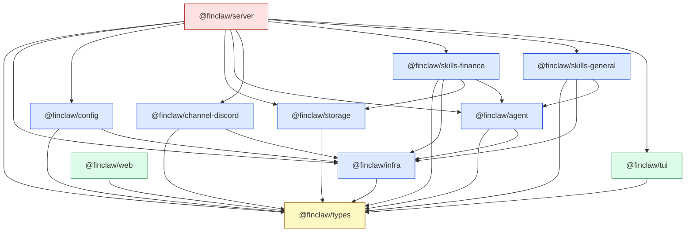
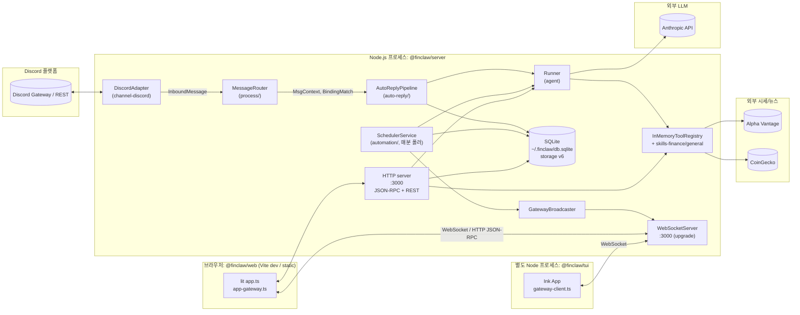
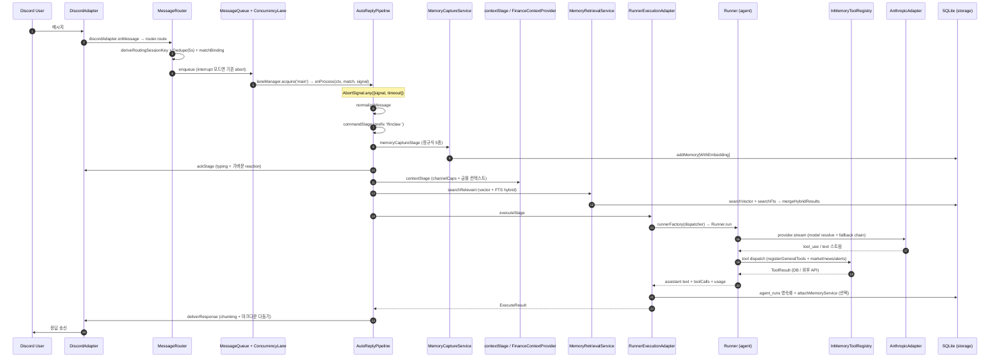

# Architecture Map

FinClaw 의 11-package 모노레포 구조, 패키지 의존 그래프, 런타임 토폴로지, 데이터 흐름을 코드 기반으로 정리한다. 모든 의존 정보는 `packages/*/package.json` 의 `dependencies.workspace:*` 항목과 `packages/server/src/main.ts` 의 실제 import / await 체인에서 추출했다.

---

## 패키지 의존 그래프 (mermaid)

순환 의존 없음. `types` 가 유일한 leaf 패키지이며, `server` 가 모든 다른 패키지를 흡수해 부팅한다. `tui` / `web` 은 런타임에 `server` 게이트웨이와 통신하지만 코드상으로는 `types` 만 import.

---

## 패키지 표

| 패키지                     | 역할                                                                                                                                            | workspace 의존                                                                                               | 주요 외부 의존                                             | 외부 노출 surface (대표)                                                                                                                                                                                                                  |
| -------------------------- | ----------------------------------------------------------------------------------------------------------------------------------------------- | ------------------------------------------------------------------------------------------------------------ | ---------------------------------------------------------- | ----------------------------------------------------------------------------------------------------------------------------------------------------------------------------------------------------------------------------------------- |
| `@finclaw/types`           | 모든 패키지 공유 contract (브랜드 타입 + 런타임 enum)                                                                                           | (none)                                                                                                       | (none)                                                     | `MsgContext`, `ChannelPlugin`, `ToolRegistry`, `RpcRequest/Response`, `Schedule`, `RPC_ERROR_CODES`, `createTimestamp/SessionKey/AgentId/ChannelId` (`packages/types/src/index.ts:2-25`)                                                  |
| `@finclaw/infra`           | 횡단 관심사 (logger, eventbus, fetch, ports, concurrency-lane, ALS 컨텍스트, ssrf, gateway-lock)                                                | `types`                                                                                                      | `tslog`                                                    | `createLogger`, `getEventBus`, `safeFetch`, `assertPortAvailable`, `ConcurrencyLane`, `ConcurrencyLaneManager`, `runWithContext`, `Dedupe`, `CircuitBreaker`, `retry` (`packages/infra/src/index.ts:1-117`)                               |
| `@finclaw/config`          | JSON5 기반 설정 로딩, Zod 스키마, env 치환, 경로 정규화, strict 검증                                                                            | `types`, `infra`                                                                                             | `json5`, `zod`                                             | `loadConfig`, `validateConfigStrict`, `ConfigValidationError` (`packages/config/src/index.ts`)                                                                                                                                            |
| `@finclaw/storage`         | SQLite (`node:sqlite`) + sqlite-vec, 스키마 마이그레이션 (v6), 임베딩, 하이브리드 검색, transactions / agent_runs / schedules / memories 테이블 | `types`                                                                                                      | `sqlite-vec`                                               | `createStorage`, `openDatabase`, `createEmbeddingProvider`, `addTransaction`, `addAgentRun`, `addSchedule`, `searchFts`, `searchVector`, `mergeHybridResults`, `chunkMarkdown` (`packages/storage/src/index.ts:1-113`)                    |
| `@finclaw/agent`           | LLM provider abstraction, model catalog/alias/router, fallback chain, tool registry, runner, profile health, auth                               | `types`, `infra`                                                                                             | `@anthropic-ai/sdk`, `zod`                                 | `Runner`, `AnthropicAdapter`, `InMemoryToolRegistry`, `InMemoryModelCatalog`, `BUILT_IN_MODELS`, `DEFAULT_FALLBACK_CHAIN`, `ProfileHealthMonitor`, `runWithModelFallback`, `resolveModelForRequest` (`packages/agent/src/index.ts:1-176`) |
| `@finclaw/channel-discord` | Discord 채널 어댑터 (discord.js v14)                                                                                                            | `types`, `infra`                                                                                             | `discord.js`, `zod`                                        | `DiscordAdapter`, `DiscordAccountSchema` (`packages/channel-discord/src/index.ts`)                                                                                                                                                        |
| `@finclaw/skills-finance`  | market / news / alerts 3 스킬 도구 모음, RSS, 시세 캐시                                                                                         | `types`, `infra`, `storage`, `agent`                                                                         | `@anthropic-ai/sdk`, `feedsmith`, `zod`                    | `registerMarketTools`, `registerNewsTools`, `registerAlertTools`, `MARKET_SKILL_METADATA`, `NEWS_SKILL_METADATA`, `ALERT_SKILL_METADATA` (`packages/skills-finance/src/index.ts`)                                                         |
| `@finclaw/skills-general`  | datetime / file-read / web-fetch 일반 도구                                                                                                      | `types`, `infra`, `agent`                                                                                    | (none)                                                     | `registerGeneralTools`, `GENERAL_SKILL_METADATA` (`packages/skills-general/src/index.ts`)                                                                                                                                                 |
| `@finclaw/server`          | 진입점 + 게이트웨이 (HTTP/JSON-RPC + WebSocket), auto-reply 파이프라인, 자동화 (cron scheduler), 채널 dock, CLI (`finclaw` bin)                 | `types`, `infra`, `config`, `storage`, `agent`, `channel-discord`, `skills-finance`, `skills-general`, `tui` | `chokidar`, `commander`, `jiti`, `picocolors`, `ws`, `zod` | `bin/finclaw.js`, `main()` (`packages/server/src/main.ts:135-504`)                                                                                                                                                                        |
| `@finclaw/tui`             | Ink + React 기반 터미널 UI. 게이트웨이 WebSocket 클라이언트                                                                                     | `types`                                                                                                      | `ink`, `ink-text-input`, `react`, `ws`                     | `App`, `gateway-client` (`packages/tui/src/index.ts`)                                                                                                                                                                                     |
| `@finclaw/web`             | Lit + Vite 기반 웹 UI. 게이트웨이 WebSocket 클라이언트 + 마크다운 렌더                                                                          | `types`                                                                                                      | `lit`, `marked`, `dompurify`, `vite`                       | `app.ts`, `app-gateway.ts`, `app-chat.ts` (`packages/web/src/main.ts`)                                                                                                                                                                    |

`tsconfig.json:3-15` 의 references 와 `pnpm-workspace.yaml:1-2` 의 `packages/*` 글롭으로 위 11 패키지가 동시 컴파일된다. `tsconfig.base.json:14` 의 `composite: true` 가 모든 sub-config 에 상속되어 project references 빌드를 가능케 한다.

---

## 런타임 토폴로지

| 프로세스                             | 진입점                                                        | 점유 포트                                                                             | 역할                                                                                    |
| ------------------------------------ | ------------------------------------------------------------- | ------------------------------------------------------------------------------------- | --------------------------------------------------------------------------------------- |
| `@finclaw/server` (Node.js 22+, ESM) | `packages/server/src/main.ts:135` (`main()`)                  | `GATEWAY_PORT` (default `3000`, host `0.0.0.0`) — `packages/server/src/main.ts:65-88` | Discord 메시지 수신·파이프라인·LLM·스토리지·gateway·cron scheduler 를 1 프로세스에 흡수 |
| `@finclaw/web`                       | `packages/web/src/main.ts` (Vite 빌드 산출물 또는 `vite dev`) | Vite 개발 서버 기본 포트 (5173). 정적 호스팅도 가능                                   | 브라우저 클라이언트. 게이트웨이로 WebSocket + JSON-RPC 호출                             |
| `@finclaw/tui`                       | `packages/tui/src/index.ts` (별도 노드 실행)                  | (해당 없음, stdin/stdout)                                                             | 게이트웨이 WebSocket 으로 chat 세션 유지하는 ink/React TUI                              |

서버는 자기 자신 외부에는 Discord, Anthropic, Alpha Vantage, CoinGecko 로 outbound. Web/TUI 는 gateway 포트로 inbound. 게이트웨이는 동일 HTTP 서버에서 `WebSocketServer({ server: httpServer })` 로 upgrade 처리 (`packages/server/src/gateway/server.ts:67-70`).

---

## 데이터 흐름: Discord 메시지 → 응답

`packages/server/src/main.ts` 부팅 후 Discord 메시지 1 건이 Anthropic 응답으로 송출되기까지의 실제 콜체인:

번호 단계 (스테이지 명세):

1. **수신** — `DiscordAdapter.setup(account)` 가 botToken 으로 로그인, `onMessage(handler)` 로 InboundMessage 변환 (`packages/server/src/main.ts:218-225, 367-371`).
2. **라우팅** — `MessageRouter.route(msg)` 에서 `deriveRoutingSessionKey` → `Dedupe.check(msg.id)` → `matchBinding` (4-tier) → `MessageQueue.enqueue` → `ConcurrencyLaneManager.acquire('main')` (`packages/server/src/process/message-router.ts:55-111`).
3. **파이프라인 진입** — `AutoReplyPipeline.process(ctx, match, signal)` 가 `AbortSignal.any([signal, AbortSignal.timeout(60_000)])` 결합 (`packages/server/src/auto-reply/pipeline.ts:86-91`).
4. **normalize** — 본문 정리 (`stages/normalize.ts`).
5. **command** — `!finclaw ` prefix 매칭 (`stages/command.ts`, `commands/built-in.ts` 의 reg).
6. **memory-capture** (Phase 26 B) — 정규식 5종 (`기억해`, `메모`, `선호`, `내 원칙`, `!finclaw remember`) 매칭 시 `addMemoryWithEmbedding` 또는 `addMemory` 호출 (`packages/server/src/auto-reply/stages/memory-capture.ts`).
7. **ack** — 채널이 지원하면 typing + reaction (`stages/ack.ts`).
8. **context** — `FinanceContextProvider` + `channelCapabilities` 합성 (`stages/context.ts`).
9. **memory-retrieval** (Phase 26 C) — `searchVector` + `searchFts` 병렬 → `mergeHybridResults` 로 시스템 프롬프트 enrich (`packages/server/src/auto-reply/stages/memory-retrieval.ts`).
10. **execute** — `RunnerExecutionAdapter.execute` → `runnerFactory(dispatcher)` 가 `Runner` 생성 → `provider.stream` → tool_use loop (`packages/server/src/auto-reply/execution-adapter.ts`, `packages/agent/src/execution/runner.ts`).
11. **agent_run 저장** (Phase 26 D) — `addAgentRun` + `attachMemoryService` (선택) (`main.ts:333-337, 462-479`).
12. **deliver** — 마크다운 다듬기 + 채널별 chunking 후 `discordAdapter.send` (`stages/deliver.ts`).

부팅 부수 흐름:

- **자동화 (cron)** — `SchedulerService.start()` 가 매 분 0초 `findDueSchedules` 폴링 → `scheduleLane` (max 1) 으로 동일 `Runner` 실행 → `onRunComplete` → `deliverScheduleResult` 가 Discord DM 또는 WebSocket broadcast (`packages/server/src/main.ts:399-440, 487-500`).
- **gateway RPC** — Web/TUI 의 `agent.runs.list`, `finance.transaction.add`, `memory.search`, `schedule.runNow` 등 호출은 `dispatchRpc` → 등록된 핸들러 → `storage.db` 직접 호출 또는 `RunnerExecutionAdapter` 재사용 (`packages/server/src/gateway/rpc/index.ts:36-106`).

---

## 핵심 추상

- **Channel 추상** — `interface ChannelPlugin<TAccount>` 가 `setup`, `onMessage`, `send`, `sendTyping`, `addReaction` 5 메서드 + `id`, `meta`, `capabilities` 3 메타 필드를 정의 (`packages/types/src/channel.ts:5-15`). 경량 표시용은 `ChannelDock` (`channel.ts:41-48`). 현재 구현체는 `DiscordAdapter` 단 1 종.
- **Pipeline Stage** — auto-reply 파이프라인은 6 + 2 stage 를 hardcoded 로 호출. `StageResult<T> = continue | skip | abort` 합집합 (`packages/server/src/auto-reply/pipeline.ts:25-28`). Stage 목록: `normalize` → `command` → `memory-capture` (Phase 26 B) → `ack` → `context` → `memory-retrieval` (Phase 26 C) → `execute` → `deliver` (`pipeline.ts:97-307`). 중간 단계는 `combinedSignal.aborted` 체크 + `observer` 훅을 모두 호출.
- **Skill** — `SkillMetadata` (`packages/types/src/skill.ts:78-87`) + `register*Tools(toolRegistry, deps)` 함수 패턴. main 부팅 시 4 종을 순차 등록: general (무조건), market (Alpha Vantage 또는 CoinGecko 키), news (Alpha Vantage 키 + market handle), alerts (market + news handle). 등록 시 `ToolMetadata.minModel` 힌트가 `routerHelper` 가 사용하는 인덱스로 빌드 (`packages/server/src/main.ts:181-292`).
- **Agent / Tool** — `ToolRegistry.register({ definition, executor })` 로 LLM function-calling 도구 등록 (`packages/agent/src/agents/tools/`). `Runner` 가 stream 에서 `tool_use` 블록 만나면 `ExecutionToolDispatcher` 로 위임. `BUILT_IN_MODELS` + `buildModelAliasIndex` + `DEFAULT_FALLBACK_CHAIN` + `ProfileHealthMonitor` 4 축이 모델 라우팅을 담당 (`main.ts:235-237`, `packages/agent/src/index.ts:38-65`).
- **Storage** — `node:sqlite` 의 `DatabaseSync` + `sqlite-vec` 확장. `SCHEMA_VERSION = 6` (`packages/storage/src/database.ts:21`). 테이블: `meta`, `conversations`, `messages`, `memories` (FTS5 + vec), `transactions`, `agent_runs`, `schedules`, `market_cache`, `alerts`, `portfolio_holdings`. `createStorage(options)` 가 `StorageAdapter` 계약 + 원시 `db` 핸들 노출 (`storage/src/index.ts:127-303`).
- **Gateway RPC** — 모듈 레벨 `Map<string, RpcMethodHandler>` 에 핸들러 등록 (`packages/server/src/gateway/rpc/index.ts:14-23`). 메서드 그룹: `system`, `config`, `chat`, `session`, `finance` (Phase 23/26 A), `memory` (Phase 26 B), `agent` (Phase 23), `agent.runs` (Phase 26 D), `schedule` (Phase 28). Zod v4 `safeParse` 로 params 검증, `AuthLevel` 4 단계 (`none / api_key / token / session`) 권한 체크 (`rpc/index.ts:60-112`). WebSocket broadcast 는 `GatewayBroadcaster` 가 채널별 delta 버퍼링 (`gateway/broadcaster.ts`).
- **Event Bus** — `getEventBus()` 가 `FinClawEventMap` 타입드 emitter 를 단일 인스턴스로 반환 (`packages/infra/src/events.ts`). 사용처: `system:ready`, `gateway:start/stop`, `gateway:rpc:request/error`, `channel:message`, agent run lifecycle.
- **Concurrency** — `ConcurrencyLane` 이 `maxConcurrent` + `maxQueueSize` + `waitTimeoutMs` 로 작업을 직렬화. main 에서 3 종 운용: router 의 lane manager(`'main'` lane), `agentRunLane` (max 1, queue 10, 2분 타임아웃), `scheduleLane` (max 1, queue 50, 5분 타임아웃) (`main.ts:393-405`).
- **Process Lifecycle** — `ProcessLifecycle` 이 cleanup 콜백 LIFO 등록 + SIGINT/SIGTERM 핸들 (`packages/server/src/process/lifecycle.ts`). 등록 순서: storage close → discord cleanup → alert monitor stop → scheduler stop → gateway stop.

---

## 어디부터 코드를 읽나? (신규 컨트리뷰터용)

1. **`packages/server/src/main.ts`** — 진입 함수 `main()` 한 곳에서 모든 wiring 이 일어난다. env 검증 → 로거 → config → storage → discord → agent/tools → 파이프라인 → router → gateway → scheduler 순. (505 라인, 모든 흐름의 색인.)
2. **`packages/server/src/process/message-router.ts`** — Discord InboundMessage 가 어떻게 dedupe → bind matching → queue → lane → pipeline 으로 전달되는지.
3. **`packages/server/src/auto-reply/pipeline.ts`** — 8 단계 스테이지 호출 + abort/observer 패턴.
4. **`packages/server/src/auto-reply/stages/`** — 각 스테이지 구현. 새 스테이지 추가 시 templates 으로 활용.
5. **`packages/server/src/auto-reply/execution-adapter.ts`** — 파이프라인이 실제 LLM 을 어떻게 호출하는지 (per-request `Runner` 생성, dispatcher 빌드).
6. **`packages/agent/src/execution/runner.ts`** — Anthropic stream 처리 + tool_use loop.
7. **`packages/agent/src/agents/tools/`** + **`packages/skills-*/src/`** — 도구 등록 패턴과 4 종 스킬 (general / market / news / alerts) 의 실제 구현.
8. **`packages/storage/src/database.ts`** + **`packages/storage/src/index.ts`** — 스키마 (v6) + `createStorage` 팩토리.
9. **`packages/server/src/gateway/server.ts`** + **`packages/server/src/gateway/rpc/index.ts`** + **`packages/server/src/gateway/rpc/methods/`** — HTTP/WebSocket 표면, JSON-RPC 디스패치, 메서드별 핸들러.
10. **`packages/server/src/automation/scheduler.ts`** — cron 폴러 + agent.run 직접 실행 + delivery 훅.
11. **`packages/web/src/main.ts`** + **`packages/tui/src/index.ts`** — 두 프론트엔드 클라이언트가 게이트웨이를 어떻게 사용하는지.

---

## 메타데이터

### 출처 (파일:라인)

- `pnpm-workspace.yaml:1-2` — 워크스페이스 글롭
- `tsconfig.json:3-15` — 11 패키지 references
- `tsconfig.base.json:1-16` — composite + NodeNext + ES2023
- `packages/types/package.json` (전체)
- `packages/infra/package.json:15-19`
- `packages/config/package.json:15-21`
- `packages/storage/package.json:15-19`
- `packages/agent/package.json:15-21`
- `packages/channel-discord/package.json:15-21`
- `packages/skills-finance/package.json:16-25`
- `packages/skills-general/package.json:15-20`
- `packages/server/package.json:13-29`
- `packages/tui/package.json:15-20`
- `packages/web/package.json:11-16`
- `packages/server/src/main.ts:135-504` — 부팅 시퀀스 전체
- `packages/server/src/main.ts:218-225` — Discord 로그인
- `packages/server/src/main.ts:228-292` — agent + skills 등록 분기
- `packages/server/src/main.ts:339-356` — pipeline 인스턴스화
- `packages/server/src/main.ts:393-440` — lane + scheduler
- `packages/server/src/main.ts:442-484` — gateway 생성
- `packages/server/src/auto-reply/pipeline.ts:25-28` — StageResult union
- `packages/server/src/auto-reply/pipeline.ts:86-307` — 스테이지 호출 순서
- `packages/server/src/process/message-router.ts:55-150` — 라우팅·큐·레인
- `packages/server/src/gateway/server.ts:54-130` — gateway 부팅 + RPC 등록
- `packages/server/src/gateway/rpc/index.ts:14-112` — 메서드 등록·디스패치
- `packages/storage/src/database.ts:21` — `SCHEMA_VERSION = 6`
- `packages/storage/src/index.ts:32-113` — storage barrel
- `packages/agent/src/index.ts:1-176` — agent barrel
- `packages/infra/src/index.ts:1-117` — infra barrel
- `packages/types/src/index.ts:1-25` — types barrel
- `packages/types/src/channel.ts:5-48` — `ChannelPlugin` / `ChannelDock`
- `packages/types/src/skill.ts:5-100` — `SkillMetadata` / `normalizeSkillMetadata`
- `packages/types/src/storage.ts:5-19` — `StorageAdapter` 계약
- `packages/server/src/automation/scheduler.ts:1-40` — scheduler 헤더

### 불확실 / 추적 못한 분기

- **plugins / services 디렉토리** — `packages/server/src/plugins/` 와 `packages/server/src/services/` 가 존재하지만 main.ts 부팅 체인에서 직접 import 흔적이 보이지 않음. 채널 dock 자동 등록 (`initChannels`) 과 별개의 플러그인 시스템인지 확인 필요.
- **openai-compat 라우트** — `packages/server/src/gateway/openai-compat/` 디렉토리가 존재하나 본 매핑에서는 구체 구조 미확인. OpenAI SDK 호환 레이어로 추정되며 별도 라우터에서 등록될 가능성.
- **CLI 분기** — `packages/server/bin/finclaw.js` (commander 기반) 의 sub-command 트리는 본 매핑에서 추적하지 않음. main.ts 와 별도 entrypoint.
- **`onlyBuiltDependencies`** — root `package.json` 에 `["esbuild", "lefthook"]` (CLAUDE/MEMORY 기록) 이 있으나 root package.json 자체는 본 매핑에서 직접 읽지 않음.
- **Web/TUI ↔ Gateway 프로토콜 세부** — JSON-RPC 메서드 카탈로그 전체와 web/tui 클라이언트의 정확한 메서드 호출 매핑은 별도 (RPC catalog 전용) 매핑 대상.
